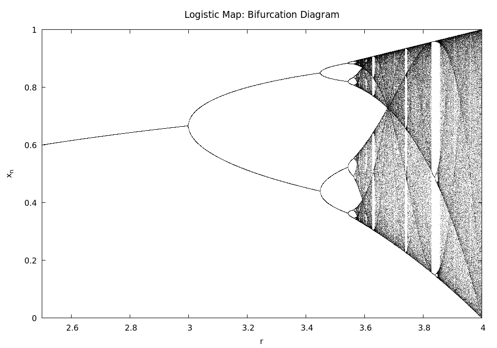
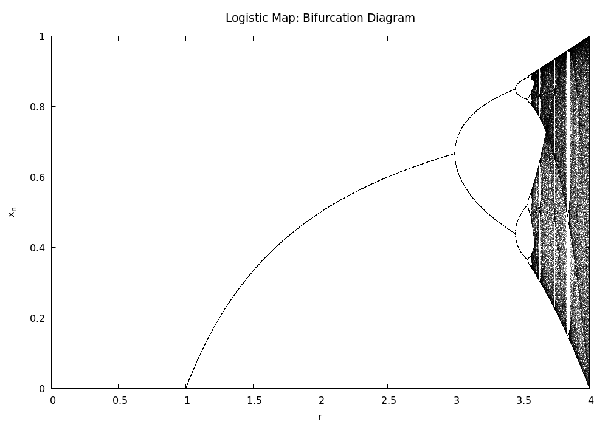

# Logistic Map Bifurcation Diagram

A numerical implementation of the **Logistic Map** using **Fortran 95**. This project explores the transition from periodic stability to chaotic behavior through the bifurcation diagram.

## Overview
The logistic map is a polynomial mapping of degree 2, often cited as an archetypal example of how complex, chaotic behavior can arise from very simple non-linear dynamical equations. It is defined by the recurrence relation:

$$x_{n+1} = r \cdot x_n \cdot (1 - x_n)$$

Where:
* $x_n$ is a number between 0 and 1.
* $r$ is the growth rate (from 0 to 4).

## Features
* **Double Precision**: High numerical stability using `real(kind=8)`.
* **High Density**: millions of points for a crisp visualization.
* **Dual View**: Separate Gnuplot scripts for full range and chaotic region.

## How to Run
1. **Generate data**: Compile and run the Fortran code.
   ```bash
   F logisticmap.f95
   ./a.out
2. **Plot**: `gnuplot -p full_view_lm.plt` or `gnuplot -p zoom_view_lm.plt`

## Visualization


